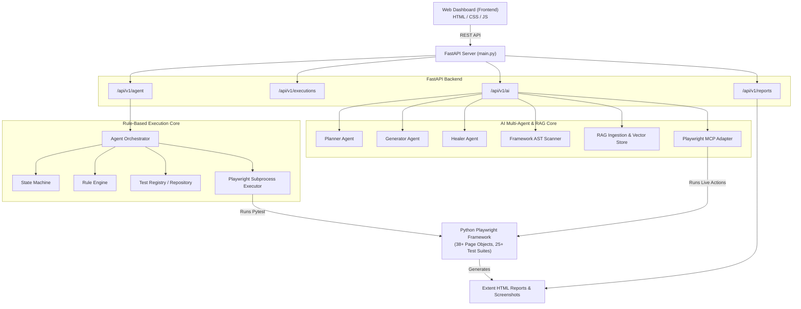
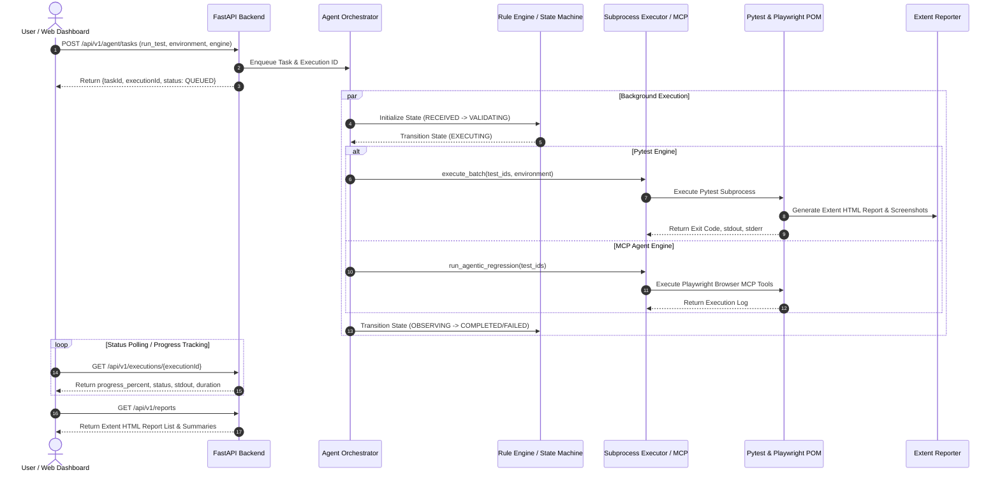

# Python Playwright Rule-Based & AI-Powered Automation Platform

An enterprise-grade, hybrid web automation and testing platform that combines a **deterministic, rule-based execution engine** with an **autonomous AI multi-agent system (RAG, Planning, Code Generation, Self-Healing, and Model Context Protocol)** for Python Playwright test suites.

---

## Table of Contents

- [Overview & Core Capabilities](#overview--core-capabilities)
- [System Architecture](#system-architecture)
- [Execution & Data Flow](#execution--data-flow)
- [Directory & File Structure](#directory--file-structure)
- [AI Multi-Agent System & RAG Engine](#ai-multi-agent-system--rag-engine)
- [Playwright Framework & Page Object Model (POM)](#playwright-framework--page-object-model-pom)
- [FastAPI REST Endpoints](#fastapi-rest-endpoints)
- [Web Dashboard Features](#web-dashboard-features)
- [Getting Started & Installation](#getting-started--installation)
- [Integrating & Registering Playwright Scripts](#integrating--registering-playwright-scripts)

---

## Overview & Core Capabilities

1. **Hybrid Execution Engine**:
   - **Rule-Based Engine**: Guarantees deterministic state machine execution (`RECEIVED` -> `VALIDATING` -> `EXECUTING` -> `OBSERVING` -> `PASSED`/`FAILED`) without LLM flakiness for standard regression runs.
   - **AI Multi-Agent System**: Utilizes specialized agents (Planner, Generator, Healer, Moderator) powered by RAG and Groq/LangChain for automated test creation and failure self-healing.
   - **MCP Adapter**: Integrates with Model Context Protocol (MCP) for live browser tool invocation and telemetry tracing.

2. **Full Page Object Model (POM) Framework**:
   - Features 38+ Modular Page Classes built on `BasePage` handling complex e-commerce interactions (PDP, PLP, Cart, Shipping/Billing, Review & Submit, Thank You, Configurator, Sublimation, My Account).
   - Includes 25+ comprehensive Pytest end-to-end regression suites.

3. **Autonomous Self-Healing & RAG Context Ingestion**:
   - Ingests Python AST symbols into a Vector Store & Symbol Registry to ensure generated test scripts strictly reuse existing POM locators and methods instead of inventing duplicate elements.
   - Diagnoses stack traces and DOM snapshot dumps upon failure to propose automatic script fixes.

4. **Rich Extent HTML Reporting & Monitoring**:
   - Generates interactive Extent HTML reports complete with step-by-step logs and automatic screenshot attachments on test failure.
   - Serves an intuitive single-page Web Dashboard for test execution, live logging, AI generation, and report inspection.

---

## System Architecture



---

## Execution & Data Flow



---

## Directory & File Structure

```
playwright-agent/
├── README.md                           # Platform documentation
├── Playwright_Agent_Postman_Collection.json # Postman API Collection
├── .env                                # Environment configurations
├── executions/                         # Stored task execution snapshots
├── frontend/                           # Web UI Single Page Application
│   ├── index.html                      # Main Dashboard layout (Execution, AI, Reports)
│   ├── app.js                          # Dashboard logic & API integration
│   └── style.css                       # Modern dark-themed styling
└── backend/                            # FastAPI Server & Engine Root
    ├── main.py                         # FastAPI entry point, static mounts, router registrations
    ├── requirements.txt                # Python dependencies
    ├── agent/                          # Core Orchestrator & Rule Engine
    │   ├── executor/
    │   │   └── playwright_executor.py  # Subprocess executor for Pytest runs
    │   ├── mcp/
    │   │   └── playwright_mcp_adapter.py # Model Context Protocol integration
    │   ├── orchestrator/
    │   │   └── agent_orchestrator.py   # Task orchestration & lifecycle manager
    │   ├── registry/
    │   │   ├── test_case_repository.py # Persists new AI-generated test cases
    │   │   └── test_registry.py        # YAML Test Registry reader
    │   ├── rules/
    │   │   └── rule_engine.py          # State transition rules & retries
    │   └── state/
    │       ├── agent_state.py          # Agent state data structures
    │       └── state_machine.py        # State Machine (RECEIVED -> FAILED/COMPLETED)
    ├── api/                            # REST API Routing Layer
    │   └── routes/
    │       ├── agent_routes.py         # Task creation, test listing, batch execution
    │       ├── ai_generation_routes.py # AI generation, planner, healer, RAG, moderation
    │       └── execution_routes.py     # Execution polling & log retrieval
    ├── config/
    │   └── test_registry.yaml          # Registry mapping test IDs to Python files
    ├── models/                         # Pydantic Request/Response Data Models
    │   ├── task.py
    │   └── execution.py
    ├── src/                            # AI Multi-Agent & RAG Pipeline
    │   ├── agents/
    │   │   ├── planner_agent.py        # AI Test Case Planner Agent
    │   │   ├── generator_agent.py      # AI Code Generation Agent (POM-enforced)
    │   │   └── healer_agent.py         # Self-Healing Agent for broken scripts
    │   ├── discovery/
    │   │   ├── framework_scanner.py    # AST Framework Scanner for POM symbols
    │   │   └── generate_symbol_registry.py
    │   ├── execution/
    │   │   └── runner.py               # Isolated script execution runner
    │   ├── generation/
    │   │   ├── orchestrator.py         # Code generation orchestrator
    │   │   ├── prompts.py              # System prompts for code generation
    │   │   └── validator.py            # AST Python syntax & POM validator
    │   ├── moderation/
    │   │   └── moderator.py            # Rule-based prompt safety & data masking
    │   ├── rag/
    │   │   ├── code_chunker.py         # AST Python code chunking strategy
    │   │   ├── embedding_client.py     # Embeddings client
    │   │   ├── vector_store.py         # Vector similarity search store
    │   │   └── ingestion_pipeline.py   # RAG directory ingestion pipeline
    │   └── reports/
    │       └── extent_parser.py        # Extent HTML report statistics parser
    └── python_playwright/              # Playwright Test Automation Framework
        ├── conftest.py                 # Pytest hooks, browser fixtures, Extent reporting
        ├── pytest.ini                  # Pytest flags & configuration
        ├── pages/                      # Page Object Model (POM) Classes (38+ files)
        │   ├── base_page.py            # Parent Page Object with generic helpers
        │   ├── home_page.py            # Home Page locators & actions
        │   ├── pdp_page.py             # Product Detail Page
        │   ├── plp_page.py             # Product Listing Page
        │   ├── cart_page.py            # Shopping Cart Page
        │   ├── shipping_billing_page.py# Checkout Shipping & Billing Page
        │   ├── review_submit_page.py   # Review & Place Order Page
        │   ├── thank_you_page.py       # Order Confirmation Page
        │   ├── configurator_page.py    # Custom Product Configurator
        │   ├── custom_sublimation_page.py # Sublimation Customization Page
        │   ├── my_account_page.py      # User Account Management
        │   ├── login_page.py           # User Authentication Page
        │   └── ...                     # (Other specialized page objects)
        ├── tests/                      # Pytest Automation Test Suites (25+ files)
        │   ├── test_tc001_verify_login.py
        │   ├── test_tc004_verify_info_and_resource.py
        │   ├── test_tc015_blank_pdp_validation.py
        │   ├── test_tc016_blank_order_with_fedex_2day_am.py
        │   ├── test_tc021_sublimation_order_placing.py
        │   ├── test_tc023_sublimation_order_placing.py
        │   └── ...                     # (Other test cases)
        ├── reports/                    # Generated Extent HTML reports & screenshots
        │   └── images/                 # Failure screenshots attached to Extent reports
        ├── test_data/                  # Environment JSON test data
        └── utils/                      # Helper modules (extent_report.py, logger.py)
```

---

## AI Multi-Agent System & RAG Engine

The platform features an advanced multi-agent pipeline designed to automate the complete software testing lifecycle:

1. **Framework Scanner (`src/discovery/framework_scanner.py`)**:
   - Parses the Python AST across all page objects in `python_playwright/pages/`.
   - Extracts Page Classes, method signatures, locator properties, and docstrings into a central **Symbol Registry**.

2. **RAG Ingestion Pipeline (`src/rag/`)**:
   - Chunks page objects and utility functions into semantic code snippets.
   - Stores code chunks in an in-memory Vector Store for top-$k$ similarity search.
   - Enables agents to construct code that accurately reuses existing methods (e.g., `cart_page.click_checkout()`) rather than re-inventing locators.

3. **Specialized Agents**:
   - 📋 **Planner Agent (`PlannerAgent`)**: Transforms user stories and acceptance criteria into structured, step-by-step test plans.
   - ⚡ **Generator Agent (`GeneratorAgent`)**: Converts test plans into AST-validated Python Playwright scripts conforming strictly to the repository's Page Object Model.
   - 🚑 **Healer Agent (`HealerAgent`)**: Receives failing test scripts, error logs, and DOM dumps to diagnose root causes and output auto-corrected scripts.
   - 🛡️ **Moderation Agent (`ContentModerator`)**: Filters inputs for security hazards and masks sensitive data before RAG embedding.

4. **Model Context Protocol (MCP) Adapter (`agent/mcp/playwright_mcp_adapter.py`)**:
   - Provides live browser interaction capability and telemetry tracing during regression executions.

---

## Playwright Framework & Page Object Model (POM)

The underlying automated test suite in `backend/python_playwright` uses standard Python Playwright and Pytest patterns:

- **`BasePage` (`pages/base_page.py`)**: Contains generic Playwright abstractions (`click_element`, `fill_text`, `wait_for_selector`, `take_screenshot`, `scroll_to_element`).
- **Page Objects**: Encapsulate locators and user workflows into clean, reusable methods.
- **Fixtures (`conftest.py`)**:
  - Automatically manages browser contexts (`chromium`, `firefox`, `webkit`).
  - Implements tracing and automatic screenshot generation on test failure.
  - Automatically initializes custom **Extent HTML Reporting** (`reports/extent_report_<timestamp>.html`).

---

## FastAPI REST Endpoints

### 1. Agent & Execution Endpoints (`/api/v1/agent` & `/api/v1/executions`)
- `GET /api/v1/agent/tests`: List all registered test cases from `test_registry.yaml`.
- `POST /api/v1/agent/tasks`: Trigger test execution (single test or batch run) against specified environments (`staging`, `production`, `qa`, `dev`).
- `GET /api/v1/executions/{executionId}`: Poll execution status, progress percentage, completion count, and live stdout/stderr.
- `GET /api/v1/executions/{executionId}/logs`: Retrieve standard output and error logs.

### 2. AI & RAG Endpoints (`/api/v1/ai`)
- `POST /api/v1/ai/planner/draft`: Draft structured test plan steps from user story inputs.
- `POST /api/v1/ai/generate`: Generate a complete POM-compliant Python Playwright test script.
- `POST /api/v1/ai/healer/heal`: Auto-repair broken test scripts using stack trace and DOM dump analysis.
- `POST /api/v1/ai/save-test-case`: Save a generated test script to disk and register it in `test_registry.yaml`.
- `POST /api/v1/ai/rag/retrieve`: Search the vector store for matching framework code chunks.
- `GET /api/v1/ai/symbols`: Retrieve the complete AST Symbol Registry.
- `POST /api/v1/ai/validate`: Validate Python AST syntax and framework compliance.
- `POST /api/v1/ai/mcp/execute-regression`: Execute test batch via Playwright MCP live telemetry.

### 3. Reporting Endpoints (`/api/v1/reports`)
- `GET /api/v1/reports`: List all available Extent HTML reports.
- `GET /api/v1/reports/summary`: Aggregate pass/fail statistics and pass rates across all reports.
- `GET /api/v1/reports/{report_name}`: View specific HTML Extent Report.
- `DELETE /api/v1/reports/{report_name}`: Delete an HTML report.
- `DELETE /api/v1/reports`: Bulk delete all generated reports.

---

## Web Dashboard Features

Accessing `http://127.0.0.1:8000/` opens the Web Dashboard:

1. 🎯 **Test Execution Dashboard**:
   - Environment selector (`Staging`, `Production`, `QA`, `Dev`).
   - Execution mode toggle (`Pytest Subprocess Engine` vs `MCP Agentic Engine`).
   - Test selection list with search and select-all controls.
   - Real-time progress bar, execution status updates, and live log stream viewer.

2. 🤖 **AI Generator & Self-Healing Hub**:
   - Input User Stories and Acceptance Criteria to generate Playwright scripts.
   - Interactive AI chat to modify generated code.
   - One-click script validation, test persistence (`Save Test Case`), and isolated execution.
   - Self-healing workbench for auto-fixing failing tests.

3. 📊 **Extent Reports Dashboard**:
   - Aggregate KPI cards (Total Reports, Total Passed, Total Failed, Average Pass Rate %).
   - Report listing table with instant preview iframe and report deletion capabilities.

---

## Getting Started & Installation

### Prerequisites
- Python 3.9 or higher
- Node.js (optional, if using external playwright browser drivers)

### Setup Steps

1. **Clone the Repository & Navigate to Project Root**:
   ```powershell
   cd playwright-agent
   ```

2. **Set up Virtual Environment**:
   ```powershell
   python -m venv venv
   .\venv\Scripts\activate
   ```

3. **Install Dependencies**:
   ```powershell
   pip install -r backend/requirements.txt
   pip install -r backend/python_playwright/requirements.txt
   ```

4. **Install Playwright Browsers**:
   ```powershell
   playwright install
   ```

5. **Start the Server**:
   ```powershell
   cd backend
   python -m uvicorn main:app --reload --port 8000
   ```

6. **Open Dashboard**:
   - Open your browser to `http://127.0.0.1:8000/`
   - Access Swagger API documentation at `http://127.0.0.1:8000/docs`

---

## Integrating & Registering Playwright Scripts

To add a new custom Playwright test to the execution platform:

1. **Create the Script**: Place your `.py` test script inside `backend/python_playwright/tests/`.
   *Example*: `backend/python_playwright/tests/test_tc026_custom_checkout.py`

2. **Register in `test_registry.yaml`**: Open `backend/config/test_registry.yaml` and add an entry:
   ```yaml
   TC026:
     name: "Custom Checkout Flow Verification"
     type: "python_script"
     path: "python_playwright/tests/test_tc026_custom_checkout.py"
     enabled: true
   ```

3. **Run via Dashboard or API**:
   - Refresh the Web Dashboard to see `TC026` in the test list.
   - Or trigger via cURL:
     ```powershell
     curl -X 'POST' \
       'http://127.0.0.1:8000/api/v1/agent/tasks' \
       -H 'Content-Type: application/json' \
       -d '{
         "action": "run_test",
         "testId": "TC026",
         "environment": "staging"
       }'
     ```
