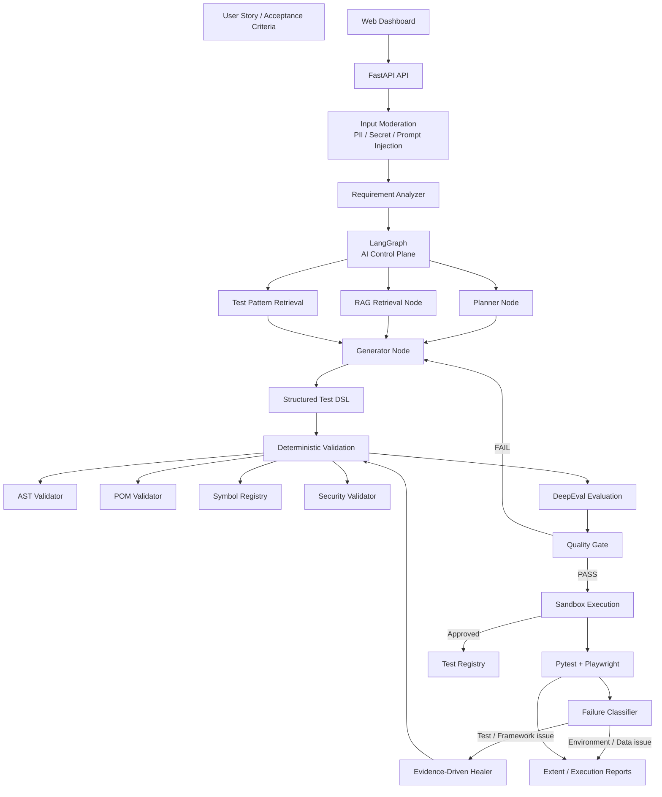
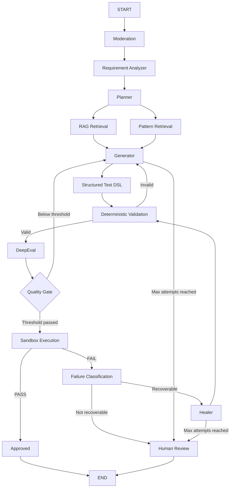
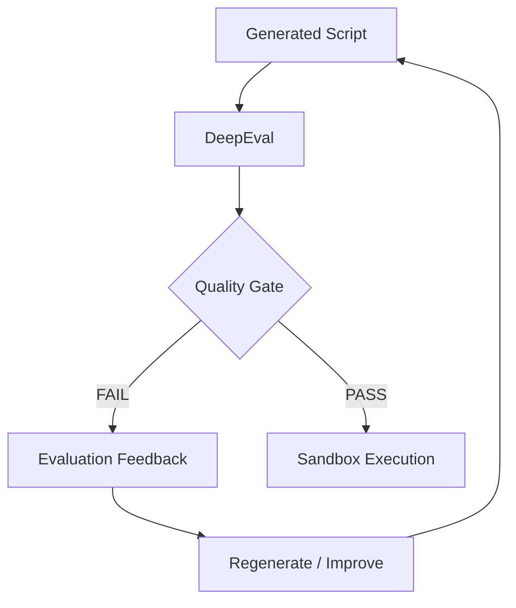
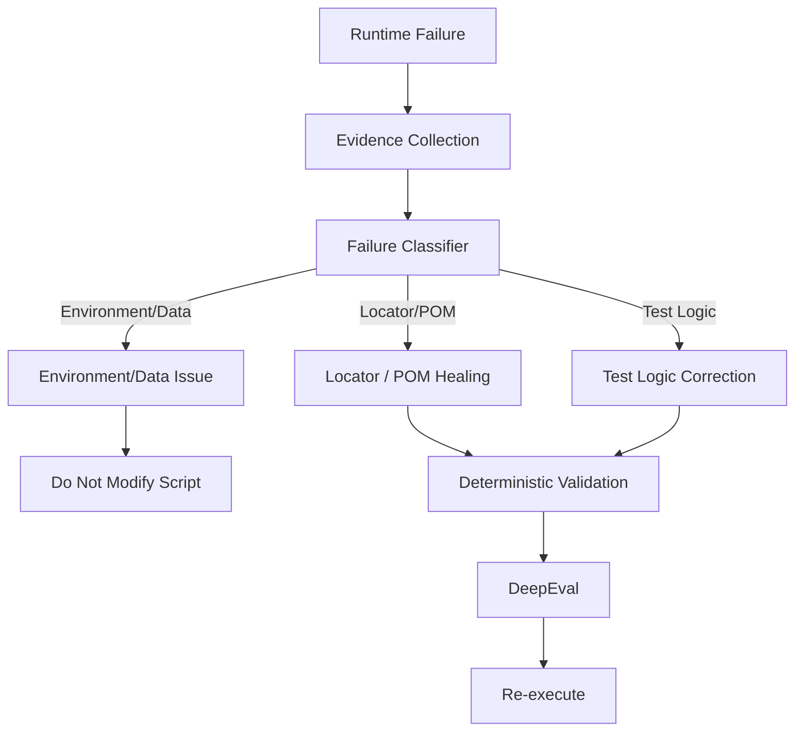
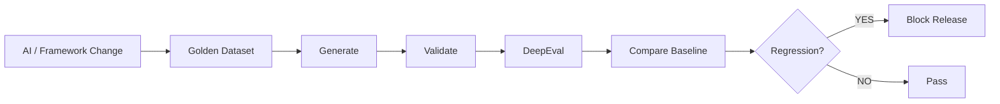
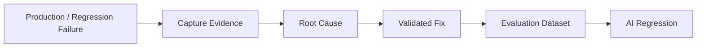

# GenAI-Powered Python Playwright Test Automation Platform
## Target Architecture — LangGraph + RAG + DeepEval + Deterministic Validation

> **Architecture principle:** The LLM is the reasoning component, not the authority.  
> The framework, Symbol Registry, deterministic validators, evaluation gates, and Playwright execution remain authoritative.

---

## 1. Architecture Goals

The platform shall evolve from a custom-orchestrated multi-agent automation platform into a controlled, measurable, and precision-focused GenAI test engineering platform.

### Primary goals

1. Generate high-quality Python Playwright tests from user stories and acceptance criteria.
2. Prevent LLM hallucination of Page Objects, methods, locators, fixtures, utilities, imports, and test data.
3. Ground generated scripts in the existing Playwright POM framework.
4. Use LangGraph as the AI workflow/control plane.
5. Use deterministic validation for structural correctness.
6. Use DeepEval as a semantic quality gate for generated scripts.
7. Execute only scripts that pass required quality gates.
8. Provide evidence-driven self-healing for genuine runtime failures.
9. Maintain requirement-to-test traceability.
10. Create a repeatable evaluation and regression framework for the AI itself.
11. Track model, prompt, RAG, framework, and evaluation versions.
12. Provide observability into both AI and test execution behavior.

---

# 2. Core Architectural Principles

## 2.1 LLM Is Not the Source of Truth

The LLM may reason about:

- What the requirement means.
- Which test scenarios are needed.
- Which framework components are relevant.
- How an existing test pattern should be adapted.
- How a failure might be repaired.

The LLM must not be trusted to determine:

- Whether a Page Object exists.
- Whether a method exists.
- Whether a locator exists.
- Whether a fixture exists.
- Whether an import exists.
- Whether generated Python is syntactically valid.
- Whether a test is safe to execute.

These decisions must be made by deterministic framework components.

---

## 2.2 Separation of Responsibilities

| Layer | Primary Responsibility | Authority |
|---|---|---|
| Requirement Analysis | Understand requirement and AC | LLM + schema validation |
| Knowledge | Retrieve existing framework knowledge | RAG + Symbol Registry |
| Reasoning | Plan and generate test intent | LLM |
| Structural Validation | Validate generated structure | Deterministic |
| Semantic Evaluation | Evaluate test quality | DeepEval |
| Runtime Validation | Determine whether test actually works | Pytest + Playwright |
| Failure Analysis | Classify runtime failures | Deterministic + LLM |
| Healing | Propose evidence-based fixes | LLM |
| Governance | Approve/reject promotion | Quality gates |

---

# 3. High-Level Target Architecture



---

# 4. System Layers

## 4.1 Presentation Layer

### Components

- Web Dashboard
- AI Generation UI
- Evaluation Dashboard
- Execution Dashboard
- Self-Healing Workbench
- Reports Dashboard

### Responsibilities

- Submit requirements.
- Display generated test plans.
- Display generated scripts.
- Show validation results.
- Show DeepEval metrics.
- Show execution results.
- Show healing attempts.
- Provide human approval where required.

---

# 5. API Layer

FastAPI remains the application/API boundary.

```text
backend/api/
├── routes/
│   ├── agent_routes.py
│   ├── ai_generation_routes.py
│   ├── evaluation_routes.py
│   ├── execution_routes.py
│   ├── registry_routes.py
│   └── reports_routes.py
```

### Recommended APIs

```text
POST /api/v1/ai/generate
POST /api/v1/ai/generate-and-evaluate
POST /api/v1/ai/evaluate
POST /api/v1/ai/heal
POST /api/v1/ai/validate

GET  /api/v1/ai/evaluations/{evaluation_id}
GET  /api/v1/ai/evaluations/{evaluation_id}/metrics

GET  /api/v1/ai/symbols
GET  /api/v1/ai/patterns

POST /api/v1/ai/sandbox/execute

POST /api/v1/agent/tasks
GET  /api/v1/executions/{execution_id}
GET  /api/v1/executions/{execution_id}/logs

GET  /api/v1/reports
GET  /api/v1/reports/summary
```

---

# 6. LangGraph AI Control Plane

LangGraph becomes the orchestration layer for AI workflows.

It should replace the responsibility currently handled by custom AI orchestration code.

## 6.1 Responsibilities

LangGraph controls:

- Node execution.
- Shared state.
- Conditional routing.
- Retry limits.
- Generation loops.
- Evaluation loops.
- Healing loops.
- Human approval checkpoints.
- Workflow persistence/checkpointing.
- Failure routing.

LangGraph should **not** replace the deterministic execution state machine.

---

# 7. LangGraph State

The workflow should maintain a strongly typed state.

Example:

```python
from typing import TypedDict, Optional


class AgentState(TypedDict):
    request_id: str

    user_story: str
    acceptance_criteria: list[str]

    test_plan: Optional[dict]

    retrieved_context: list[dict]
    retrieved_symbols: list[dict]
    retrieved_patterns: list[dict]

    generated_dsl: Optional[dict]
    generated_script: Optional[str]

    ast_valid: bool
    pom_valid: bool
    security_valid: bool
    grounding_valid: bool

    evaluation_score: Optional[float]
    evaluation_results: Optional[dict]
    evaluation_feedback: Optional[list[str]]

    execution_status: Optional[str]
    execution_logs: Optional[str]

    failure_type: Optional[str]
    failure_evidence: Optional[dict]

    generation_attempts: int
    healing_attempts: int

    final_decision: Optional[str]
```

The state should be persisted where workflow recovery is required.

---

# 8. LangGraph Workflow

## 8.1 Primary Generation Workflow



---

# 9. Requirement Analyzer

The Requirement Analyzer converts unstructured user input into structured test intent.

### Input

```text
User Story
Acceptance Criteria
Business Rules
Optional Test Data
Optional Environment
```

### Output

```json
{
  "feature": "Checkout",
  "objective": "Verify successful checkout",
  "preconditions": [],
  "test_steps": [],
  "assertions": [],
  "acceptance_criteria": [],
  "negative_conditions": [],
  "required_test_data": []
}
```

The result must pass schema validation before reaching the Generator.

---

# 10. Structured Test DSL

## 10.1 Why a DSL Is Required

The LLM should not have unrestricted freedom to generate Python.

Preferred workflow:

```text
Requirement
    ↓
LLM
    ↓
Structured Test DSL
    ↓
Schema Validation
    ↓
Symbol Validation
    ↓
Python Code Generator
    ↓
AST Validation
```

This significantly reduces:

- Hallucinated methods.
- Invalid imports.
- Invalid locators.
- Framework violations.
- Inconsistent coding patterns.

---

## 10.2 Example DSL

```json
{
  "test_id": "TC026",
  "name": "Verify checkout flow",
  "preconditions": [
    "User is logged in",
    "Product is available"
  ],
  "steps": [
    {
      "page": "CartPage",
      "action": "click_checkout",
      "arguments": {}
    },
    {
      "page": "ShippingBillingPage",
      "action": "enter_shipping_address",
      "arguments": {
        "zipcode": "600001"
      }
    }
  ],
  "assertions": [
    {
      "page": "ReviewSubmitPage",
      "condition": "order_summary_visible"
    }
  ]
}
```

---

# 11. Symbol Registry

The Symbol Registry is the authoritative representation of the automation framework.

The existing AST scanning capability should evolve into a complete framework knowledge graph/registry.

## 11.1 Registry Information

Each symbol should capture:

```json
{
  "class": "CartPage",
  "method": "click_checkout",
  "file": "pages/cart_page.py",
  "parameters": [],
  "return_type": "None",
  "description": "Clicks checkout",
  "locators": [],
  "dependencies": [],
  "framework_version": "1.0.0",
  "status": "ACTIVE"
}
```

## 11.2 Registry Validation

Generated code:

```python
cart_page.click_checkout()
```

Registry:

```text
CartPage.click_checkout = FOUND
```

Result:

```text
PASS
```

Generated code:

```python
cart_page.proceed_to_payment()
```

Registry:

```text
CartPage.proceed_to_payment = NOT FOUND
```

Result:

```text
BLOCK
```

This check must be deterministic.

---

# 12. RAG Architecture

RAG is used for contextual discovery.

It is not the final authority.

## 12.1 RAG Pipeline

```mermaid
flowchart LR

    SRC["Framework Source Code"]
    AST["AST Scanner"]
    CHUNK["Semantic Code Chunker"]
    META["Metadata Enrichment"]
    EMB["Embedding"]
    DB["Persistent Vector Store"]
    RET["Hybrid Retrieval"]
    RERANK["Reranker"]
    GEN["Generator"]

    SRC --> AST
    AST --> CHUNK
    CHUNK --> META
    META --> EMB
    EMB --> DB
    DB --> RET
    RET --> RERANK
    RERANK --> GEN
```



## 12.2 Metadata

Every retrieved chunk should contain metadata such as:

```json
{
  "type": "page_method",
  "class": "CartPage",
  "method": "click_checkout",
  "file": "pages/cart_page.py",
  "module": "cart",
  "framework": "playwright",
  "version": "1.0.0"
}
```

## 12.3 Retrieval Hierarchy

Use:

```text
1. Exact Symbol Match
2. Metadata Filtering
3. Semantic Search
4. Hybrid Search
5. Reranking
```

The Generator should receive only the most relevant and trusted context.

---

# 13. Test Pattern Library

Existing high-quality tests should become reusable generation patterns.

Example:

```text
patterns/
├── login/
├── pdp/
├── plp/
├── cart/
├── checkout/
├── shipping/
├── payment/
├── my_account/
├── configurator/
├── sublimation/
├── headwear/
└── digital_print/
```

Each pattern should define:

- Preconditions.
- Typical workflow.
- Page Objects.
- Required assertions.
- Test data.
- Known negative paths.
- Example implementation.

Generation should prefer adapting known patterns instead of generating from scratch.

---

# 14. Deterministic Validation Layer

Every generated script must pass deterministic validation before evaluation/execution.

## 14.1 Validation Components

```text
validation/
├── ast_validator.py
├── pom_validator.py
├── symbol_validator.py
├── fixture_validator.py
├── import_validator.py
├── security_validator.py
└── test_data_validator.py
```

## 14.2 Checks

### AST Validation

- Python syntax.
- Valid AST.
- Invalid constructs.
- Dangerous constructs.

### POM Validation

- Page Object usage.
- No direct locator bypass when prohibited.
- Existing framework methods.
- Existing fixtures.

### Symbol Validation

- Class exists.
- Method exists.
- Parameter compatibility.

### Import Validation

- Imported module exists.
- Framework-approved imports only.

### Fixture Validation

- Fixture exists.
- Fixture scope is valid.

### Security Validation

- No hardcoded credentials.
- No secrets.
- No unsafe shell commands.
- No unauthorized file operations.

---

# 15. Hallucination Firewall

The validation layer must block:

```text
Unknown Page Object
Unknown method
Unknown locator
Unknown fixture
Unknown utility
Unknown import
Unknown test data
Unknown API
Invented framework component
```

This is a hard gate.

DeepEval must not override deterministic failures.

---

# 16. DeepEval Evaluation Layer

DeepEval evaluates semantic quality after deterministic validation.

## 16.1 Evaluation Dimensions

Recommended dimensions:

| Metric | Purpose |
|---|---|
| Requirement Coverage | Does the test cover the supplied requirement and AC? |
| Grounding Accuracy | Does generated behavior match retrieved framework context? |
| Framework Compliance | Does it follow POM/framework conventions? |
| Test Completeness | Are required steps and assertions present? |
| Assertion Quality | Are assertions meaningful and sufficient? |
| Code Quality | Is the generated test maintainable? |

---

# 17. DeepEval Quality Gate

Example policy:

```python
approved = (
    ast_valid
    and pom_valid
    and security_valid
    and grounding_score >= 0.95
    and requirement_score >= 0.90
    and evaluation_score >= 0.85
)
```

Thresholds must be calibrated against the project's golden dataset.

Do not blindly average scores.

Critical failures must block promotion even if the overall score is high.

---

# 18. DeepEval Feedback Loop

DeepEval feedback should return to the LangGraph workflow.



Example feedback:

```text
Requirement AC-03 is not covered.

The generated test directly uses a Playwright locator
instead of the existing CartPage method.

Assertion for order confirmation is missing.
```

This feedback should be included in the next generation attempt.

---

# 19. Generation Limits

Prevent infinite AI loops.

Recommended initial limits:

```text
Generation attempts: 3
Healing attempts:     2
```

After the limit:

```text
→ Human Review
```

The limits should be configurable.

---

# 20. Sandbox Execution

No generated script should be promoted directly to the production test registry.

Required lifecycle:

```text
DRAFT
  ↓
VALIDATED
  ↓
EVALUATED
  ↓
SANDBOX_PASSED
  ↓
APPROVED
  ↓
REGISTERED
  ↓
REGRESSION
```

---

# 21. Deterministic Execution Engine

The existing rule-based state machine remains separate from LangGraph.

```text
RECEIVED
   ↓
VALIDATING
   ↓
EXECUTING
   ↓
OBSERVING
   ↓
PASSED / FAILED
```

LangGraph controls the AI lifecycle.

The deterministic state machine controls test execution lifecycle.

They must not be merged.

---

# 22. Runtime Failure Classification

A failed test must first be classified before healing.

```text
Failure Classifier
│
├── LOCATOR_CHANGE
├── ASSERTION_ERROR
├── TIMEOUT
├── AUTHENTICATION_ERROR
├── TEST_DATA_ERROR
├── APPLICATION_ERROR
├── NETWORK_ERROR
├── ENVIRONMENT_ERROR
└── FRAMEWORK_ERROR
```

---

# 23. Evidence-Driven Self-Healing

The Healer must receive evidence rather than only the exception.

## Evidence

```text
Stack Trace
Screenshot
DOM Snapshot
Playwright Trace
Current URL
Network Errors
Original Script
Original Requirement
POM Metadata
Symbol Registry
Previous Healing Attempts
```

## Healing Flow



An environment failure should not cause the AI to modify a valid test.

---

# 24. Requirement Traceability

Every generated test must maintain traceability.

```json
{
  "test_id": "TC026",
  "requirement_id": "REQ-026",
  "acceptance_criteria": [
    "AC-01",
    "AC-02",
    "AC-03"
  ],
  "steps": [
    {
      "step": 1,
      "source": "AC-01"
    },
    {
      "step": 2,
      "source": "AC-02"
    },
    {
      "step": 3,
      "source": "AC-03"
    }
  ]
}
```

The system should detect uncovered acceptance criteria before execution.

---

# 25. AI Confidence Model

Do not use a single unqualified "AI confidence" score.

Display component-level quality:

```text
AI TEST QUALITY
──────────────────────────────

Requirement Coverage       96%
Grounding Accuracy         98%
Framework Compliance      100%
Test Completeness          91%
Assertion Quality          88%
Code Quality               94%

Generation Attempts          2
Healing Attempts             0

Decision:
APPROVED
```

Approval must be based on explicit hard gates.

---

# 26. Golden Evaluation Dataset

Create a controlled dataset of representative requirements.

```text
evaluation/
└── datasets/
    ├── login_cases.json
    ├── pdp_cases.json
    ├── plp_cases.json
    ├── cart_cases.json
    ├── checkout_cases.json
    ├── configurator_cases.json
    ├── sublimation_cases.json
    ├── headwear_cases.json
    ├── digital_print_cases.json
    └── negative_cases.json
```

Each case should contain:

```json
{
  "requirement": "...",
  "acceptance_criteria": [],
  "expected_page_objects": [],
  "required_assertions": [],
  "expected_test_pattern": ""
}
```

---

# 27. AI Regression Testing

Every change to any of the following should trigger the golden dataset:

```text
LLM model
Prompt
RAG strategy
Retriever
Reranker
Embedding model
LangGraph workflow
Evaluation metrics
POM framework
Framework version
Test generation rules
```

Workflow:



---

# 28. Production Failure Learning Loop

Real failures should continuously improve evaluation.



This creates a feedback loop from real automation failures back into the AI quality system.

---

# 29. Versioning and Reproducibility

Every generated script must store:

```json
{
  "model_version": "...",
  "prompt_version": "...",
  "rag_version": "...",
  "retriever_version": "...",
  "embedding_version": "...",
  "framework_version": "...",
  "evaluation_version": "...",
  "generation_attempt": 2
}
```

This allows the team to identify why generated quality changed.

---

# 30. Observability

## 30.1 AI Telemetry

Track:

```text
LLM latency
Input tokens
Output tokens
LLM cost
RAG latency
Number of retrieved chunks
Reranking latency
Generation attempts
Evaluation latency
Evaluation scores
Healing attempts
Approval rate
```

## 30.2 Test Telemetry

Track:

```text
Execution duration
Step duration
Retries
Browser
Environment
Failure category
Network failures
Screenshots
Traces
```

---

# 31. Dashboard

The dashboard should provide four major views.

## 31.1 Test Execution

```text
Environment
Test Selection
Execution Status
Progress
Logs
Duration
Failures
```

## 31.2 AI Generation

```text
Requirement
Generated Plan
Retrieved Context
Generated DSL
Generated Python
Validation
```

## 31.3 AI Evaluation

```text
Requirement Coverage
Grounding
Framework Compliance
Completeness
Assertion Quality
Code Quality
Overall Decision
```

## 31.4 Self-Healing

```text
Failure Type
Evidence
Root Cause
Original Script
Proposed Fix
Validation
Evaluation
Healing Attempts
Final Result
```

---

# 32. Recommended Directory Structure

```text
playwright-agent/
│
├── README.md
├── architecture.md
├── .env
├── executions/
├── evaluation/
│   ├── datasets/
│   ├── baselines/
│   └── reports/
│
├── patterns/
│   ├── login/
│   ├── cart/
│   ├── checkout/
│   ├── configurator/
│   ├── sublimation/
│   ├── headwear/
│   └── digital_print/
│
├── frontend/
│
└── backend/
    │
    ├── main.py
    ├── requirements.txt
    │
    ├── api/
    │   └── routes/
    │       ├── agent_routes.py
    │       ├── ai_generation_routes.py
    │       ├── evaluation_routes.py
    │       ├── execution_routes.py
    │       ├── registry_routes.py
    │       └── reports_routes.py
    │
    ├── config/
    │
    ├── models/
    │
    ├── agent/
    │   ├── executor/
    │   ├── registry/
    │   ├── rules/
    │   └── state/
    │
    ├── ai/
    │   │
    │   ├── graph/
    │   │   ├── state.py
    │   │   ├── workflow.py
    │   │   ├── routing.py
    │   │   └── nodes/
    │   │       ├── moderation.py
    │   │       ├── requirement_analyzer.py
    │   │       ├── planner.py
    │   │       ├── retrieval.py
    │   │       ├── pattern_retrieval.py
    │   │       ├── generator.py
    │   │       ├── validator.py
    │   │       ├── evaluator.py
    │   │       ├── executor.py
    │   │       ├── failure_analyzer.py
    │   │       ├── healer.py
    │   │       └── human_review.py
    │   │
    │   ├── dsl/
    │   │   ├── schema.py
    │   │   └── compiler.py
    │   │
    │   ├── discovery/
    │   │   ├── framework_scanner.py
    │   │   ├── symbol_registry.py
    │   │   └── generate_symbol_registry.py
    │   │
    │   ├── rag/
    │   │   ├── code_chunker.py
    │   │   ├── embedding_client.py
    │   │   ├── vector_store.py
    │   │   ├── retriever.py
    │   │   ├── reranker.py
    │   │   └── ingestion_pipeline.py
    │   │
    │   ├── validation/
    │   │   ├── ast_validator.py
    │   │   ├── pom_validator.py
    │   │   ├── symbol_validator.py
    │   │   ├── fixture_validator.py
    │   │   ├── import_validator.py
    │   │   ├── security_validator.py
    │   │   └── test_data_validator.py
    │   │
    │   ├── evaluation/
    │   │   ├── evaluator.py
    │   │   ├── metrics.py
    │   │   ├── thresholds.py
    │   │   └── datasets/
    │   │
    │   ├── moderation/
    │   │   └── moderator.py
    │   │
    │   └── prompts/
    │       ├── planner.py
    │       ├── generator.py
    │       ├── evaluator.py
    │       └── healer.py
    │
    └── python_playwright/
        ├── conftest.py
        ├── pytest.ini
        ├── pages/
        ├── tests/
        ├── reports/
        ├── test_data/
        └── utils/
```

---

# 33. End-to-End Generation Contract

A generated test is eligible for execution only when:

```text
Requirement parsed
        AND
DSL schema valid
        AND
All referenced symbols exist
        AND
AST valid
        AND
POM compliant
        AND
Security validation passed
        AND
Requirement coverage >= threshold
        AND
Grounding >= threshold
        AND
DeepEval quality >= threshold
        AND
Sandbox execution passed
```

Otherwise:

```text
BLOCK
```

or:

```text
HUMAN_REVIEW
```

---

# 34. Recommended Quality State Machine

```text
RECEIVED
   ↓
MODERATED
   ↓
ANALYZED
   ↓
PLANNED
   ↓
CONTEXT_RETRIEVED
   ↓
GENERATED
   ↓
VALIDATED
   ↓
EVALUATED
   ↓
QUALITY_APPROVED
   ↓
SANDBOX_PASSED
   ↓
REGISTERED
   ↓
REGRESSION_READY
```

Failure states:

```text
VALIDATION_FAILED
EVALUATION_FAILED
SANDBOX_FAILED
HEALING_REQUIRED
HUMAN_REVIEW
REJECTED
```

---

# 35. Implementation Roadmap

## Phase 1 — Precision Foundation

1. Upgrade AST Framework Scanner.
2. Build authoritative Symbol Registry.
3. Implement deterministic POM validator.
4. Implement fixture/import/security validators.
5. Create Test Pattern Library.
6. Define Structured Test DSL.

### Exit Criteria

Generated scripts cannot reference unknown framework symbols.

---

## Phase 2 — LangGraph

1. Implement shared LangGraph state.
2. Implement Requirement Analyzer node.
3. Implement Planner node.
4. Implement RAG Retrieval node.
5. Implement Pattern Retrieval node.
6. Implement Generator node.
7. Implement conditional routing.
8. Implement retry limits.
9. Implement checkpointing.

### Exit Criteria

AI generation workflow is controlled by LangGraph.

---

## Phase 3 — DeepEval

1. Build evaluation dataset.
2. Implement Requirement Coverage metric.
3. Implement Grounding metric.
4. Implement Framework Compliance metric.
5. Implement Test Completeness metric.
6. Implement Assertion Quality metric.
7. Implement Code Quality metric.
8. Implement thresholds.
9. Feed evaluation feedback back into LangGraph.

### Exit Criteria

A generated script cannot be promoted solely because generation succeeded.

---

## Phase 4 — Runtime Intelligence

1. Sandbox execution.
2. Failure classification.
3. Evidence collection.
4. Failure Analyzer.
5. Healer node.
6. Healing validation.
7. Healing evaluation.
8. Healing execution loop.

### Exit Criteria

Only evidence-supported failures trigger AI modification.

---

## Phase 5 — AI Governance

1. Golden dataset.
2. AI regression suite.
3. Prompt versioning.
4. Model versioning.
5. RAG versioning.
6. Evaluation versioning.
7. Quality baselines.
8. Release gates.

### Exit Criteria

AI framework changes are measurable and reproducible.

---

# 36. Non-Functional Requirements

## Reliability

- Deterministic validation must run before execution.
- AI retries must have hard limits.
- Failed validation must prevent promotion.
- Runtime environment failures must not automatically modify valid tests.

## Security

- Secrets must never be embedded into generated scripts.
- User input must pass moderation.
- Generated code must pass security validation.
- Execution must occur in controlled environments.

## Maintainability

- LangGraph nodes must have single responsibilities.
- Deterministic validators must remain independent from LLM providers.
- Prompt versions must be tracked.
- Evaluation metrics must be independently testable.

## Observability

- Every AI workflow must have a request/execution ID.
- Every generation attempt must be recorded.
- Every evaluation result must be persisted.
- Every healing attempt must be auditable.

---

# 37. Key Design Decision

The target architecture intentionally separates five types of intelligence:

```text
                 PRECISION MODEL
                       │
     ┌─────────────────┼──────────────────┐
     │                 │                  │
     ▼                 ▼                  ▼
 KNOWLEDGE          REASONING         VALIDATION
 RAG + Registry     LangGraph/LLM     AST/POM/Rules
     │                 │                  │
     └─────────────────┼──────────────────┘
                       │
                       ▼
                  EVALUATION
                    DeepEval
                       │
                       ▼
                   REALITY
                Playwright/Pytest
```

### Final rule

> **RAG tells the model what may be relevant.  
> The Symbol Registry tells the system what actually exists.  
> LangGraph controls what happens next.  
> Deterministic validators decide what is structurally allowed.  
> DeepEval measures semantic quality.  
> Playwright determines whether the test actually works.**

This separation is the foundation for a powerful, precise, and auditable GenAI test automation platform.
